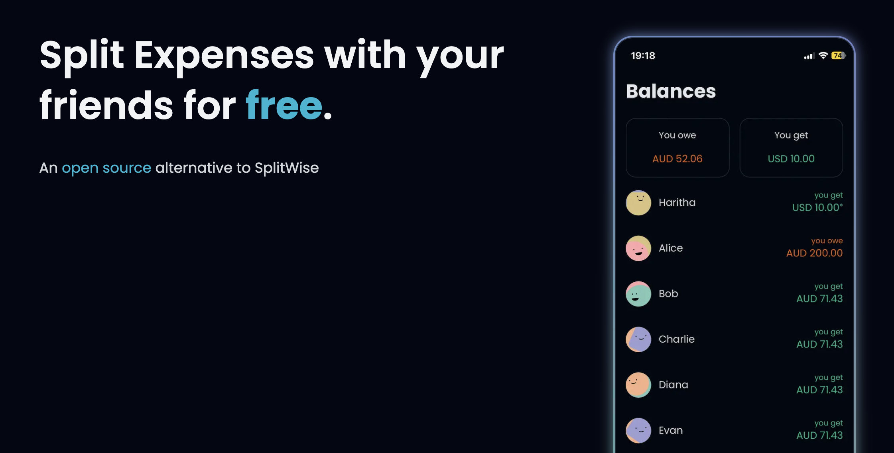
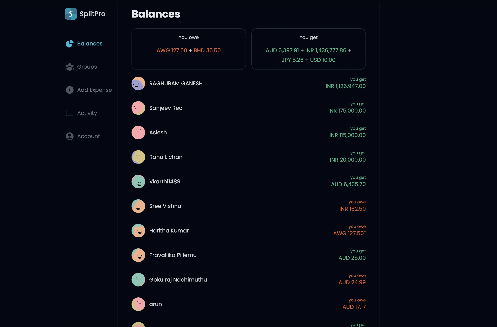
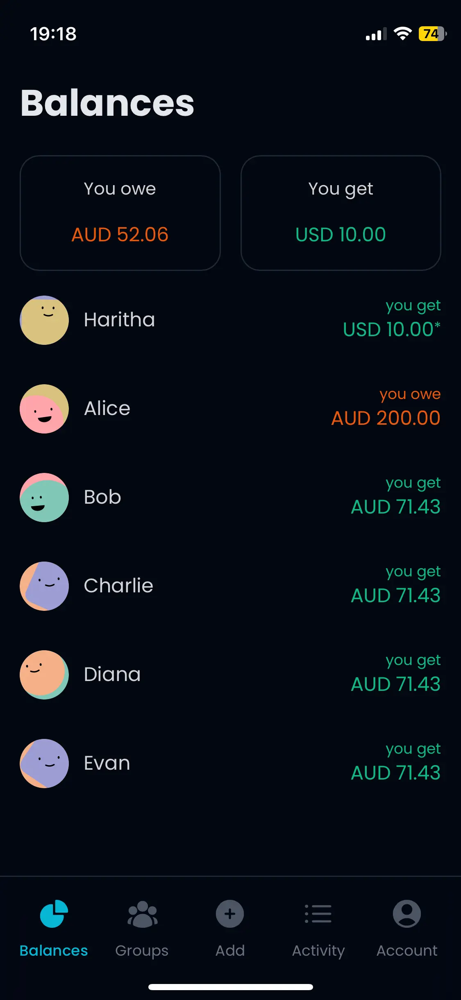

  

  <h1 align="center">SplitPro</h1>
  <h2 align="center">An open source alternative to Splitwise</h2>

## About

SplitPro is a self-hosted, open source way to share expenses with friends. It is designed as a replacement for Splitwise.

## Quick start

1. Use Docker Compose from [docker/prod/compose.yml](docker/prod/compose.yml).
2. Copy `.env.example` to `.env` and configure auth, database, and uploads.
3. Start the stack and log in to create your first account.

See [docker/README.md](docker/README.md) and [docs/CONFIGURATION.md](docs/CONFIGURATION.md) for the full setup steps.

## Core features

- Add expenses with a friend or a group.
- Split methods: equal, percentage, share, exact, adjustments, and settlements.
- Categories, currencies, dates, and receipt attachments (stored locally).
- Negative expenses are supported for refunds and corrections.
- PWA support with push notifications.
- Activity feed with edits and deletions.
- Detailed balances per person and per group.

## UI preview

## Usage overview

### 1) Expenses, balances, and activity

Create expenses with categories, currencies, dates, and receipt attachments. SplitPro supports negative expenses for refunds and corrections. View per-person balances, detailed group balances, and an activity feed that includes edits and deletions.

### 2) Application info

SplitPro is a PWA and that is the recommended way to use the app. It supports push notifications for new expenses and updates.

### 3) Groups

Groups are the primary way to use SplitPro. You can invite friends by email, or add them directly if they are already in your friends list. Group debt simplification is optional, and the group balance view provides a detailed breakdown.

### 4) Data utilities

Splitwise import supports friends and groups (partial import). Expenses themselves are not imported yet. You can export data from the balances view and account settings.

### 5) Translations

Translations are managed in Weblate. When a language reaches 100%, it is enabled in the next update.

### 6) Authentication

SplitPro uses NextAuth. At least one provider must be configured.

- Email sign-in (magic link)
- OAuth (Google)
- OIDC (Authentik, Keycloak, or custom OIDC)

Username/password login is not supported. You can lock down an instance by disabling signups and invites. See [docs/CONFIGURATION.md](docs/CONFIGURATION.md) and [docs/AUTHENTICATION.md](docs/AUTHENTICATION.md) for details.

### 7) Currency conversions

SplitPro can display balances in a single currency, convert expense amounts, and convert group balances. Provider availability and rate limits depend on the configured rate provider. See [docs/CURRENCY_CONVERSIONS.md](docs/CURRENCY_CONVERSIONS.md).

### 8) Recurring transactions

Recurring expenses require a PostgreSQL database with the `pg_cron` extension. We publish a prebuilt Postgres image with `pg_cron`; example usage is in [docker/prod/compose.yml](docker/prod/compose.yml). If you use another database, you must enable the extension and adjust configuration. See [docs/RECURRING_TRANSACTIONS.md](docs/RECURRING_TRANSACTIONS.md).

### 9) Bank transaction integration

Bank integration allows you to load transactions from providers like Plaid and convert them into expenses. This feature was provided by @alexanderwassbjer, who is currently maintaining related issues. See [docs/BANK_TRANSACTIONS.md](docs/BANK_TRANSACTIONS.md).

## Limitations and notes

- SplitPro computes balances from expenses on the fly using database views. Expenses are the source of truth, which keeps balances consistent and trustworthy. For self hosted deployments the efficiency of database aggregations is entirely sufficient, but please do report any performance issues.
- Recurring transactions require `pg_cron`, which does not support cron ranges or lists.
- Currency conversion accuracy and coverage depend on the selected provider.
- Receipts are stored on local disk; make sure your uploads volume is persistent.

## Supporting docs

- [docs/CONFIGURATION.md](docs/CONFIGURATION.md)
- [docs/AUTHENTICATION.md](docs/AUTHENTICATION.md)
- [docs/MIGRATING_FROM_V1.md](docs/MIGRATING_FROM_V1.md)
- [docs/CURRENCY_CONVERSIONS.md](docs/CURRENCY_CONVERSIONS.md)
- [docs/RECURRING_TRANSACTIONS.md](docs/RECURRING_TRANSACTIONS.md)
- [docs/BANK_TRANSACTIONS.md](docs/BANK_TRANSACTIONS.md)
- [docker/README.md](docker/README.md)

## Versions

SplitPro is for self hosting. To get the most recent features, build an image from source. Stabilized changes (GitHub releases) are available as Docker images on DockerHub and GHCR. The old community instance at https://splitpro.app is no longer maintained and is stuck at version `1.3.4`.

## Why

Splitwise is one of the best apps to add expenses and bills.

We understand that every app needs to make money, after all, lots of effort has been put into Splitwise. The main problem is how they implemented this.

Monetising on pro features or ads is fine, but asking money for adding expenses (core feature) is frustrating.

We were searching for other open-source alternatives (Let's be honest, any closed-source product might do the same and we don't have any reason to believe otherwise).

We managed to find a good app [spliit.app](https://spliit.app/) by [Sebastien Castiel](https://scastiel.dev/) but it's not a complete replacement and didn't suit my workflow sadly. Check it out to see if it fits you.

## Translations

The app translations are managed using [a Weblate project](https://hosted.weblate.org/projects/splitpro/).
You can easily add missing translations, fix issues you find and a new language! Just be aware that a new language
also needs to be added in the code and open an issue for that once you finish translating the files.
Here is the current state of translation:

## FAQ

#### How numerically stable is the internal logic?

All numbers are stored in the DB as `BigInt` data, with no floats what so ever, safeguarding your expenses from rounding errors or lack of precision. This holds true for currencies with large nominal values that might outgrow the safe range of JS number type.

#### How are leftover pennies handled?

In case of an expense that cannot be split evenly, leftover amounts are distributed deterministically across participants, based on amount and date.

#### Currency rate providers

See [docs/CURRENCY_CONVERSIONS.md](docs/CURRENCY_CONVERSIONS.md) for provider details and limits.

## Getting started

### Deployment with Docker

We provide Docker images on DockerHub and GHCR.

- https://hub.docker.com/r/ossapps/splitpro
- https://ghcr.io/oss-apps/splitpro

For setup instructions, see [docker/README.md](docker/README.md). For environment variables, see [docs/CONFIGURATION.md](docs/CONFIGURATION.md).

### Development and contributing

See the [docs/CONTRIBUTING.md](docs/CONTRIBUTING.md) document.

## Sponsors

We are grateful for the support of our sponsors.

### Our Sponsors

## Star History

